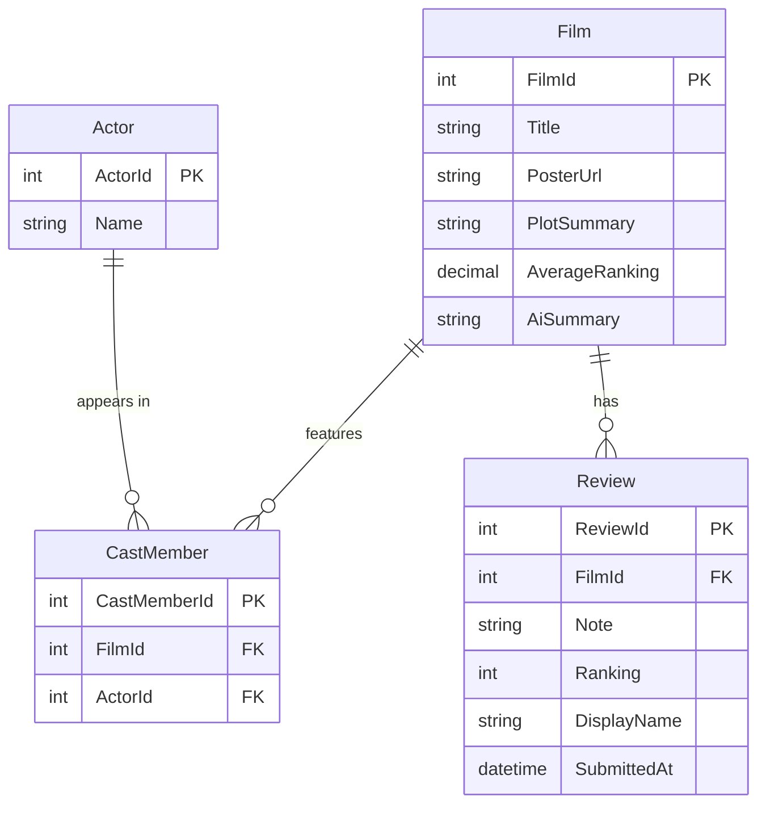

# Film Review App

A full-stack skills demonstration project built with .NET 10, React (TypeScript), and SQLite. The application allows users to view a film, submit reviews and rankings, and see an AI-generated summary of reviewer sentiment via Azure OpenAI.

This project was built to demonstrate clean architecture, considered technical decision-making, and full-stack capability across the Microsoft stack.

---

## What It Does

- Displays film details — poster, plot summary, and cast
- Allows users to submit a review note, a ranking out of 10, and an optional display name
- Shows a paginated list of reviews, ordered newest first
- Calculates and displays an average ranking across all submitted reviews
- Generates an AI summary of review sentiment via Azure OpenAI (gpt-5-nano)

---

## Tech Stack

| Layer | Technology |
|---|---|
| Backend API | .NET 10 Web API |
| ORM | Entity Framework Core |
| Database | SQLite |
| Frontend | React (TypeScript) via Vite |
| Frontend Hosting | Azure Static Web Apps |
| AI Integration | Azure OpenAI (gpt-5-nano) |
| API Docs | Swagger / OpenAPI |
| Tests | xUnit + WebApplicationFactory |

---

## Solution Structure

```
FilmReview.slnx
├── Documents/                 ← Architecture docs, ADRs, wireframe, ERD
├── FilmReview.Core/           ← Business logic, services, interfaces, DTOs
├── FilmReview.Data/           ← EF Core, DbContext, repositories, migrations
├── FilmReview.API/            ← Controllers, middleware, Program.cs, DI registration
├── FilmReview.Web/            ← React (TypeScript) frontend via Vite
└── FilmReview.Tests/          ← xUnit unit and integration tests (35 passing)
```

The dependency rule is strictly observed — Core has no outward dependencies. Data implements Core interfaces. API is the composition root.

---

## Getting Started

### Prerequisites

- .NET 10 SDK
- Node.js (for the React frontend)
- An Azure OpenAI deployment via Azure AI Foundry (see [AI Setup Guide](./AI_Setup_Guide.md))

### Running the API

```bash
cd src/FilmReview.API
dotnet run
```

Swagger UI is available at `https://localhost:{port}/swagger` once running.

### Running the Frontend

```bash
cd FilmReview.Web
npm install
npm run dev
```

### Running the Tests

```bash
dotnet test
```

### Configuration

Azure OpenAI credentials are required for the AI summary feature. See the [AI Setup Guide](./Documents/AI_Setup_Guide.md) for instructions on setting up Azure AI Foundry and configuring credentials via user secrets.

---

## Wireframe


---

## Architecture

Architecture is documented using the C4 model. The full C4 diagram set (Context, Container, and Component levels) is available as a PDF.

📄 [Design C4 — FilmReviewApp.pdf](./Documents/Design%20C4%20-%20FilmReviewApp.pdf)

### Entity Relationship Diagram



---

## API

Full API specification: [API_Specification.md](./Documents/API_Specification.md)

---

## Architecture Decision Records

Key decisions are documented as ADRs in the [`Documents/ADR`](./Documents/ADR) folder.

| # | Decision |
|---|---|
| [ADR-0001](./Documents/ADR/0001-why-rest.md) | Why REST |
| [ADR-0002](./Documents/ADR/0002-why-layered-architecture.md) | Why layered architecture |
| [ADR-0003](./Documents/ADR/0003-error-handling-strategy.md) | Error handling strategy |
| [ADR-0004](./Documents/ADR/0004-logging-and-observability.md) | Logging and observability |
| [ADR-0005](./Documents/ADR/0005-testing-approach.md) | Testing approach |
| [ADR-0006](./Documents/ADR/0006-sqlite.md) | SQLite as the database |
| [ADR-0007](./Documents/ADR/0007-azure-static-web-apps.md) | Azure Static Web Apps for frontend hosting |
| [ADR-0008](./Documents/ADR/0008-react-spa.md) | React as a Single-Page Application |
| [ADR-0009](./Documents/ADR/0009-ai-review-summary.md) | AI review summary |
| [ADR-0010](./Documents/ADR/0010-persisted-average-ranking-and-ai-summary.md) | Persisting average ranking and AI summary |
| [ADR-0011](./Documents/ADR/0011-security.md) | Security and authentication |
